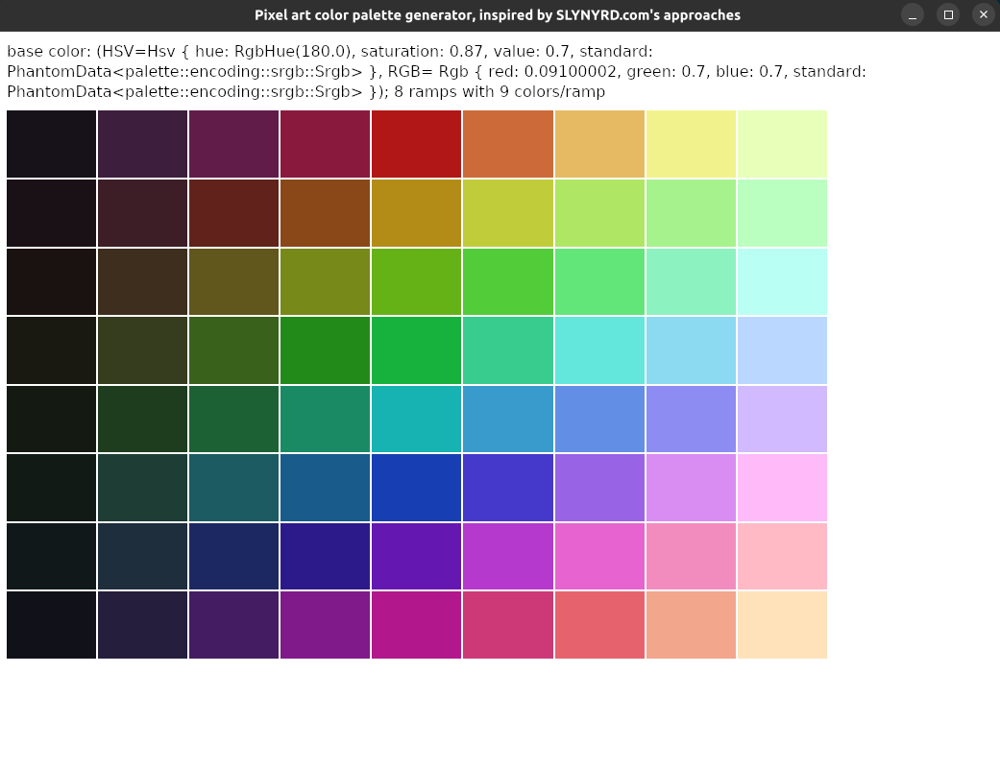

# Pixel art color palette generator

This is a tool to create pixel art color palettes, similar to those mentioned in
[this tutorial from slynyrd.com](https://www.slynyrd.com/blog/2018/1/10/pixelblog-1-color-palettes),
or found on <https://lospec.com/palette-list>.

My goal is to create pixel art for games with visual similar to these:

<!-- GET URL from  -->
<table>
<tr>
<td></td>
<td></td>
<td></td>
<td></td>
</tr>
<tr>
<td></td>
<td></td>
<td></td>
<td></td>
</tr>
</table>

> Generated with DALL-E

To that end, I believe a rich palette using SLYNYRD's technique will be useful.
Something like this:


However, generating it by hand is pretty tedious, so I wanted a small GUI.

This also serve as a learning project for Rust & one of its GUI lib, `iced`.

## Goals

- Core
  - [x] GUI on Linux
  - [x] Generate everything based on a base color.
  - [x] Use Hue-Saturation-Value (HSV/HSB) to choose the base color.
  - [x] Show 8 ramps with 9 color/ramp.
  - [x] Show hexadecimal color codes (kinda. It only shows in CLI/.gpl file, not the GUI).
- Stretch
  - [ ] Cross-platform GUI (native + web)
  - [x] Customizable number of ramps besides the base ramp, as long as `count(ramps) * hue_shift_step = 360°`.
  - [x] Customizable number of colors in a ramp.
  - [x] Export palettes to .ase (Aseprite) format.
  - [ ] GUI allows changing configurations and re-generating palette (e.g: color picker, input boxes for saturation/brightness deltas).
  - [ ] Show hexadecimal color codes in GUI.
  - [ ] Click on color and copy its hexadecimal color code.

## How to use

The actual program is functional enough for me to use, but require compiling.

```
# git clone https://github.com/bitsgofer/tools_slynyrd_color_palettes.git
# cd tools_slynyrd_color_palettes
# cargo run
```

The GUI should show up:



And a `my_palette.gpl` file should be created:

```
# ls -alF
total 124
drwxrwxr-x  6 you you  4096 Jan  8 21:03 ./
drwxrwxr-x 27 you you  4096 Jan  7 20:46 ../
-rw-rw-r--  1 you you 79770 Jan  8 00:25 Cargo.lock
-rw-rw-r--  1 you you   280 Jan  8 00:25 Cargo.toml
drwxrwxr-x 10 you you  4096 Jan  8 21:19 .git/
-rw-rw-r--  1 you you   100 Jan  8 00:25 .gitattributes
-rw-rw-r--  1 you you    16 Jan  8 21:14 .gitignore
drwxrwxr-x  2 you you  4096 Jan  8 00:25 images/
-rw-rw-r--  1 you you  2734 Jan  8 21:13 my_palette.gpl     <--- import this to Aseprite
-rw-rw-r--  1 you you  2549 Jan  8 21:21 README.md
drwxrwxr-x  2 you you  4096 Jan  8 00:25 src/
drwxrwxr-x  3 you you  4096 Jan  4 22:49 target/
```

```
# cat my_palette.gpl
GIMP Palette
Name: my_palette

25 25 25	#191919
61 61 61	#3D3D3D
97 97 97	#616161
138 138 138	#8A8A8A
179 179 179	#B3B3B3
204 204 204	#CCCCCC
230 230 230	#E6E6E6
# ... more
```

To customize anything, you need to edit the config for now:

```rust
// src/main.rs

impl Default for PaletteGenerator {
    fn default() -> PaletteGenerator {
        //  USE: hsv8_to_hsv(hue, saturation, value/brightness)   <-- EDIT HERE
        let hsv = hsv8_to_hsv(180.0, 87.0, 70.0).unwrap();

        PaletteGenerator {
            cfg: Config {
                hsv_base: hsv,
                colors_per_ramp: 9,
                ramps_per_palette: 8,
                base_ramp_saturation_deltas: vec![
                // USE: saturation differences                    <-- EDIT HERE
                //
                //                colors[3]-colors[4]
                //                         |
                //                         | base: colors[4]
                //                         |     |
                //  colors[0] - colors[1]  |     |          colors[8]-colors[7]
                //    |                    |     |                          |
                //    |                    |     |  colors[5]-colors[4]     |
                //    |                    |     |      |                   |
                //    v                    v     v      v                   v
                    -17.0, -20.0, -11.0, -05.0, 00.0, -15.0, -15.0, -15.0, -15.0,
                ],
                base_ramp_brightness_deltas: vec![
                // USE: brightness differences                    <-- EDIT HERE
                //
                //                colors[3]-colors[4]
                //                        |
                //                        |  base: colors[4]
                //                        |    |
                //  colors[0] - colors[1] |    |            colors[8]-colors[7]
                //  |                     |    |                          |
                //  |                     |    |    colors[5]-colors[4]   |
                //  |                     |    |     |                    |
                //  v                     v    v     v                    v
                 -14.0, -14.0, -16.0, -16.0, 00.0, 010.0, 010.0, 005.0, 005.0,
                ],
            },
            canvas_cache: canvas::Cache::default(),
            ramps: vec![],
        }
    }
}
```

P.S: I will get to making the changes more easier via GUI (much, much) later.
